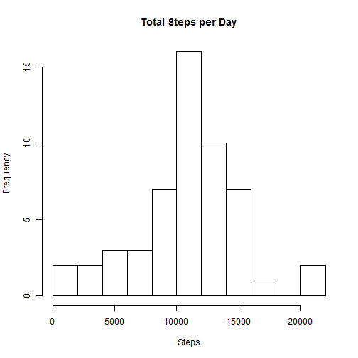
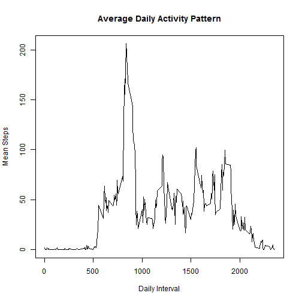
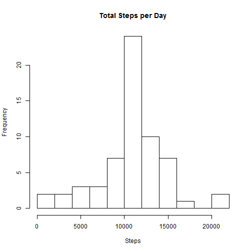
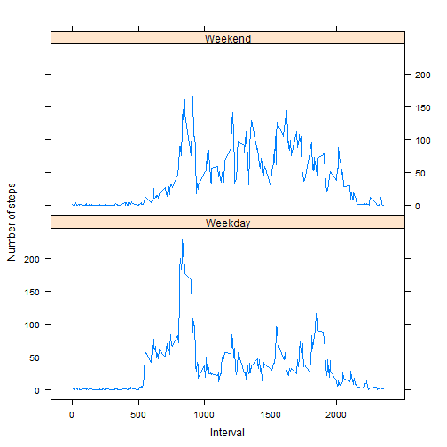

# Reproducible Research: Peer Assessment 1


## Loading and preprocessing the data


```r
require(data.table,quietly=TRUE)
#load the raw data from the activity.zip folder
#read from the zipped activity file
#zipped folder name
zipFolder <- "activity.zip"
# Create a name for the temp dir 
zipdir <- tempfile()
dir.create(zipdir)

# Unzip the file into the dir
unzip(zipFolder, exdir=zipdir)
# Get the files in the dir
files <- list.files(zipdir)

# Get the full name of the file
file <- paste(zipdir, files[1], sep="/")
# Read the file
rawActivityData <- read.csv(file,as.is=T)

# save an original copy for use later
activity.df <- data.frame(date=as.Date(rawActivityData$date),
                          interval=as.numeric(rawActivityData$interval),
                          steps=rawActivityData$steps)
activityData <- data.table(activity.df)
```

The preprocessed data has the following form:

```r
activityData
```

```
##              date interval steps
##     1: 2012-10-01        0    NA
##     2: 2012-10-01        5    NA
##     3: 2012-10-01       10    NA
##     4: 2012-10-01       15    NA
##     5: 2012-10-01       20    NA
##    ---                          
## 17564: 2012-11-30     2335    NA
## 17565: 2012-11-30     2340    NA
## 17566: 2012-11-30     2345    NA
## 17567: 2012-11-30     2350    NA
## 17568: 2012-11-30     2355    NA
```

------

## What is mean total number of steps taken per day?

```r
totalStepsPerDay = activityData[,sum(steps),keyby="date"]
setnames(totalStepsPerDay,"V1","totalSteps")

hist(totalStepsPerDay$totalSteps,breaks=8,
     main="Total Steps per Day",xlab="Steps")
```

 

```r
meanSteps <- mean(totalStepsPerDay$totalSteps,na.rm=T)

medianSteps <- median(totalStepsPerDay$totalSteps,na.rm=T)
```

The mean number of steps per day is 10766.

The median number per day is 10765.

------

## What is the average daily activity pattern?


```r
#calculate the mean for each interval
meanStepsPerInterval = activityData[,mean(steps,na.rm=T),keyby="interval"]
setnames(meanStepsPerInterval,"V1","meanSteps")
x <- meanStepsPerInterval$interval
y <- meanStepsPerInterval$meanSteps
plot(x=x,y=y,type = "l", col = 1,main="Average Daily Activity Pattern"
     ,ylab="Mean Steps",xlab="Daily Interval")
```

 

```r
maxInterval <- x[which(y==max(y))]
```

The interval with the maximum mean number of steps is 835

------

## Imputing missing values


```r
totalMissing <- sum(is.na(activityData$steps))
```

The total missing observations is 2304.


```r
totalMissing <- sum(is.na(activityData$steps))

# find the missing values
missing <- which(is.na(activity.df$steps))
#replace all missing values with the mean from that time interval
for (i in missing)
  activity.df$steps[i] <- 
  meanStepsPerInterval[interval==activity.df$interval[i]]$meanSteps

newActivityData <- data.table(activity.df)
```

The new activity data table with imputed values has the same form but with no missing values.


```r
newActivityData
```

```
##              date interval   steps
##     1: 2012-10-01        0 1.71698
##     2: 2012-10-01        5 0.33962
##     3: 2012-10-01       10 0.13208
##     4: 2012-10-01       15 0.15094
##     5: 2012-10-01       20 0.07547
##    ---                            
## 17564: 2012-11-30     2335 4.69811
## 17565: 2012-11-30     2340 3.30189
## 17566: 2012-11-30     2345 0.64151
## 17567: 2012-11-30     2350 0.22642
## 17568: 2012-11-30     2355 1.07547
```

```r
newTotalStepsPerDay = newActivityData[,sum(steps),keyby="date"]
setnames(newTotalStepsPerDay,"V1","totalSteps")

hist(newTotalStepsPerDay$totalSteps,breaks=8,
     main="Total Steps per Day",xlab="Steps")
```

 

```r
meanSteps <- mean(newTotalStepsPerDay$totalSteps,na.rm=T)

medianSteps <- median(newTotalStepsPerDay$totalSteps,na.rm=T)
```

The mean number of steps per day is 10766.

The median number per day is 10766.

The mean and median have not changed appreciably. This makes sense since mean was used to impute missing values. Since the mean and median were essentially the same in the original data, the impact of using the mean to impute values does not alter the distribution, in this case.

------

## Are there differences in activity patterns between weekdays and weekends?


```r
require(lattice,quietly=TRUE)
weekend <- c("Saturday","Sunday")
newActivityData$dayOfWeek <- weekdays(newActivityData$date)
newActivityData$weekPeriod <- as.factor(
  ifelse(newActivityData$dayOfWeek %in% c("Saturday","Sunday"),"Weekend","Weekday"))

meanStepsPerInterval = newActivityData[,mean(steps),keyby="interval,weekPeriod"]
setnames(meanStepsPerInterval,"V1","steps")

xyplot(steps ~ interval | weekPeriod, data = meanStepsPerInterval, layout = c(1, 2),
       type="l",ylab="Number of steps",xlab="Interval",
       scales = list(x = list(at = seq(from = 0, to = 2000, by = 500))))
```

 

 
Weekdays and weekends have very different patterns of activity. During the weekday, it appears that a large amount of walking occurs early, before 900. Could this be getting ready for work? It likely is not walking to work since there is no associated walk after work. The weekend has many more periods of greater than 50 steps. The low number of steps during the week as compared to the same period on the weekend may indicate a desk job.

----------------
